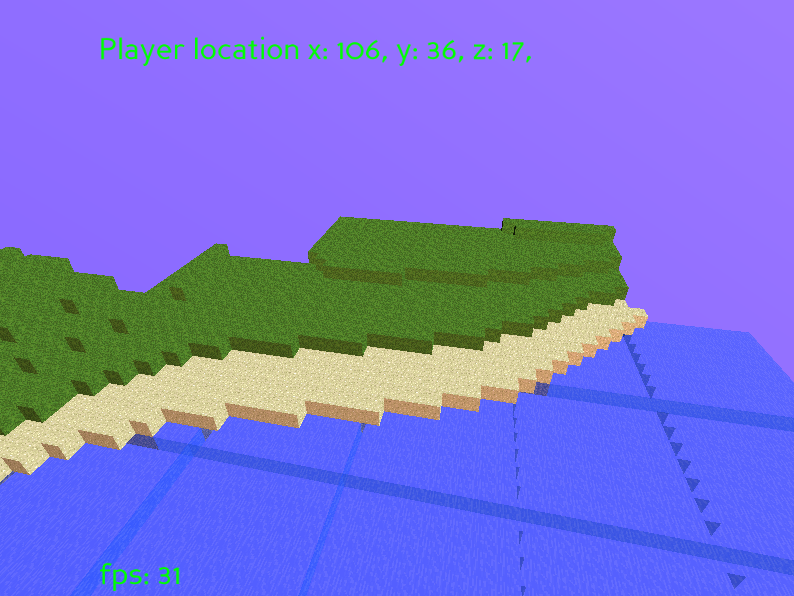
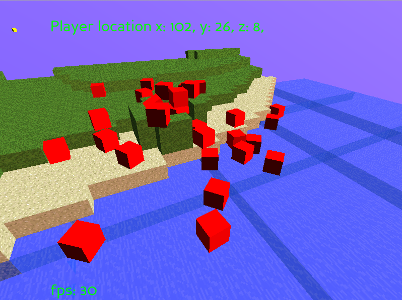
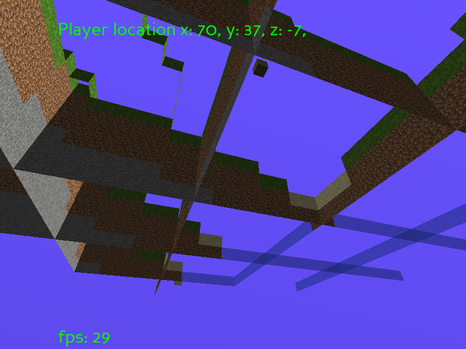

## PyCraft 
Minecraft... in Python! 

The aim of this project was to do what I thought was impossible with python - make a 3D game. I've stopped working on this, because I'm not really interested in remaking Minecraft!

Here's a look:

Physics and building are supported:

The world is chunked and created with perlon noise!:

# Features: 

- chunk handeling for infinite worlds
- random world generation with perlin noise
- physics
- adding/removing blocks

# Controls:

- W,A,S,D for movement
- SPACE for up
- C for down
- E to place a block
- T to remove a block
- B to make a physics enabled block 
- R to reset position to 0,0,0
- Q to enable wireframe

